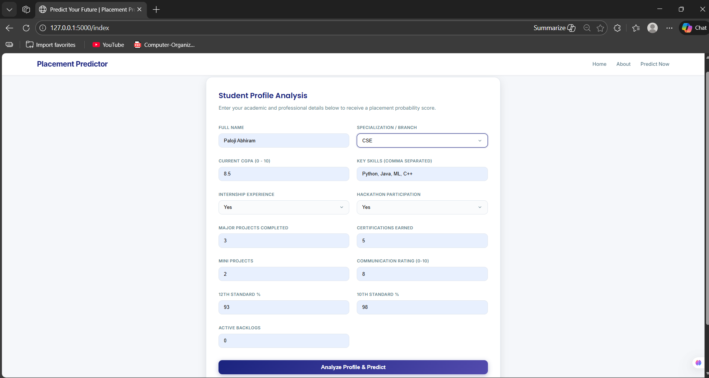
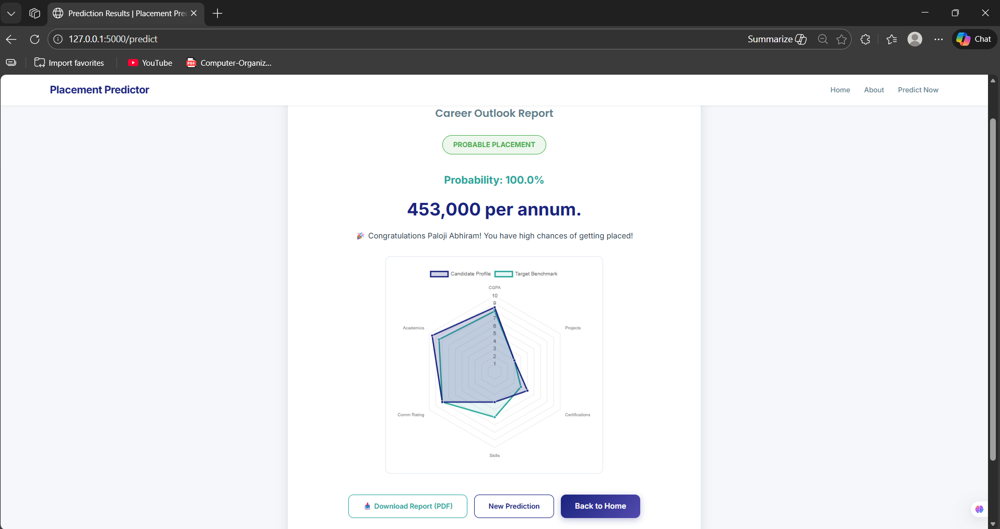

# Placement Prediction using Machine Learning

This project presents a machine learning–based system that predicts student placement probability and expected salary. It is primarily designed to support students—especially from Tier-2 and Tier-3 institutions—in understanding how academic performance, technical skills, and extracurricular activities influence placement outcomes.

The application provides analytical insights rather than a simple binary result, enabling students to make informed decisions about skill development and career preparation.

---

## ✨ Final Output






---

## 📚 Table of Contents
- [Overview](#overview)
- [Problem Statement](#problem-statement)
- [Dataset](#dataset)
- [Installation](#installation)
- [Folder Structure](#folder-structure)
- [Data Preprocessing](#data-preprocessing)
- [Model Training](#model-training)
- [Evaluation](#evaluation)
- [Results](#results)
- [Flask Application](#flask-application)
- [Contributing](#contributing)
- [License](#license)

---

## 🧠 Overview

Campus placements play a crucial role in shaping students’ careers. This project introduces an intelligent placement prediction system using machine learning algorithms such as the **Random Forest Classifier** and **Decision Tree models** to estimate:

- The probability of a student getting placed  
- The expected salary package if placed  

Additionally, a Flask-based web application enables real-time predictions through a user-friendly interface.

---

## ❓ Problem Statement

Students from Tier-2 and Tier-3 colleges often lack clear insights into how their academic profile and skill set impact placement opportunities. Similarly, institutions do not always have data-driven tools to provide early career guidance. This project addresses these challenges by developing a predictive system that evaluates multiple student attributes and generates meaningful placement and salary predictions.

---

## 📊 Dataset

The datasets used in this project include various academic, technical, and experiential attributes such as:

- CGPA (Cumulative Grade Point Average)  
- Technical and soft skills  
- Internship and hackathon participation  
- Communication skills rating  
- Academic performance (10th and 12th percentages)  
- Number of projects, certifications, and active backlogs  

Dataset files:
- `Datasets/Placement_Prediction_data.xlsx`  
- `Datasets/Salary_prediction_data.xlsx`  

---

## 💻 Installation

To run this project locally, follow the steps below:

1. Clone the repository:
```bash
git clone https://github.com/yourusername/Placement_Prediction_Project.git
cd Placement_Prediction_Project